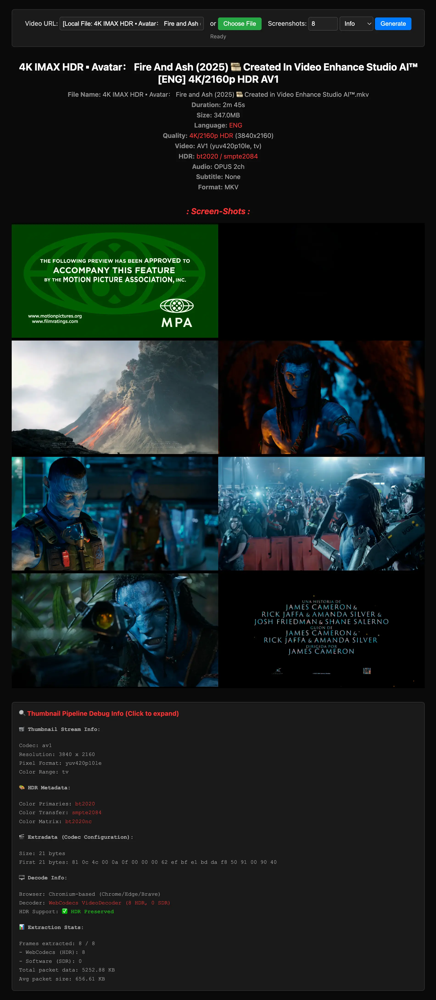

# 🎬 Movi-Player

> Modern, modular video player for the web powered by WebCodecs + FFmpeg WASM  
> Built for HDR, performance, and professional streaming workflows.

[](https://www.npmjs.com/package/movi-player)
[](LICENSE)
[](https://caniuse.com/webcodecs)

👉 **Install:** `npm i movi-player`
👉 **Docs:** [mrujjwalg.github.io/movi-player](https://mrujjwalg.github.io/movi-player/)
👉 **Demo:** [movi-player-examples.vercel.app](https://movi-player-examples.vercel.app/element.html)

### Element Module (Full UI)


👉 [View Live Demo](https://movi-player-examples.vercel.app/element.html) | [See Code Example](https://github.com/mrujjwalg/movi-player-examples/blob/main/element.html)

### Player Module (Custom UI)


👉 [View Live Demo](https://movi-player-examples.vercel.app/youtube.html) | [See Code Example](https://github.com/mrujjwalg/movi-player-examples/blob/main/youtube.html)

> 🚀 **No Server-Side Processing Required!** — All video parsing, demuxing, and decoding happens entirely in the browser using FFmpeg WASM & WebCodecs. Multiple audio/subtitle tracks are supported without any conversion or processing!

## ⚠️ Important: CORS & Headers

Because Movi-Player uses **WebAssembly** and **SharedArrayBuffer** for high-performance streaming, your server needs to support:

1.  **Range Requests:** Required for seeking in large files.
2.  **CORS Headers:** If your video is on a different domain.
3.  **COI Headers (Optional):** For maximum performance (Zero-copy), set:
    - `Cross-Origin-Opener-Policy: same-origin`
    - `Cross-Origin-Embedder-Policy: require-corp`

**Can't modify server headers?** Use a **Service Worker** to inject COI headers client-side:

```javascript
// sw.js
self.addEventListener('fetch', (event) => {
  event.respondWith(
    fetch(event.request).then((response) => {
      const newHeaders = new Headers(response.headers);
      newHeaders.set('Cross-Origin-Embedder-Policy', 'require-corp');
      newHeaders.set('Cross-Origin-Opener-Policy', 'same-origin');
      return new Response(response.body, {
        status: response.status,
        statusText: response.statusText,
        headers: newHeaders,
      });
    })
  );
});

// Register in your app
if ('serviceWorker' in navigator) {
  navigator.serviceWorker.register('/sw.js');
}
```

---

## ⚡ TL;DR

Movi-Player helps you build **high-performance video players in browsers** with:

✅ WebCodecs + FFmpeg WASM decoding  
✅ HDR detection & rendering  
✅ Canvas-based secure rendering  
✅ Modular size (45KB → 410KB)  
✅ MP4, MKV, TS, WebM, MOV support  
✅ **No server-side processing** — All processing happens in the browser!

> If you need serious video playback in web apps — Movi-Player is for you.

📦 Install:

```bash
npm i movi-player
```

- Full Documentation → https://mrujjwalg.github.io/movi-player/
- Default Player → https://movi-player-examples.vercel.app/element.html
- Demuxer → https://movi-player-examples.vercel.app/demuxer.html
- Custom UI → https://movi-player-examples.vercel.app/youtube.html

---

## 🤔 Why Movi-Player?

| Feature                   | movi-player | video.js | hls.js |
| ------------------------- | ----------- | -------- | ------ |
| WebCodecs                 | ✅          | ❌       | ❌     |
| HDR Support               | ✅          | ❌       | ❌     |
| MKV / TS                  | ✅          | ❌       | ❌     |
| Canvas Renderer           | ✅          | ❌       | ❌     |
| Modular                   | ✅          | ❌       | ❌     |
| FFmpeg WASM               | ✅          | ❌       | ❌     |
| No Server-Side Processing | ✅          | ❌       | ❌     |

---

## ✨ Key Features

- **🎯 Modular Design**: Choose what you need—demuxer only (45KB), player (180KB), or full element (410KB)
- **⚡ Hardware-First Decoding**: WebCodecs API with automatic software fallback
- **🌈 HDR Support**: BT.2020/PQ/HLG metadata (demuxer) + Display-P3 rendering (player)
- **📦 Universal Format Support**: MP4, MKV, WebM, MOV, **MPEG-TS**, and more via FFmpeg
- **🎬 Professional UI**: Built-in controls, **Context Menu**, gestures, themes, and multi-track selection
- **🖼️ Smart Thumbnails**: Accurate HDR-aware thumbnail generation with MPEG-TS timestamp correction
- **💾 Memory Efficient**: Pull-based streaming handles multi-GB files with ease
- **🎨 Custom Element**: Drop-in `<video>` replacement with enhanced capabilities
- **🔄 Multi-Track**: Runtime audio/video/subtitle track switching
- **📱 Touch-Friendly**: Tap, swipe, and pinch gestures for mobile
- **🎯 ISO Standards Compliant**: Full compliance with ISO/ITU-T specifications

---

- **[📚 Documentation](https://mrujjwalg.github.io/movi-player/)** - Comprehensive guides and API reference
- **[🎮 Live Examples](https://github.com/MrUjjwalG/movi-player-examples)** - Interactive demos and sample code
- **[🏗️ Architecture Guide](https://mrujjwalg.github.io/movi-player/guide/architecture)** - System design and internals
- **[🎬 API Reference](https://mrujjwalg.github.io/movi-player/api/player)** - Complete API documentation

---

## 🚀 Quick Start

### Installation

```bash
npm install movi-player
```

### Basic Usage

#### Option 1: CDN (No Install Required)

```html
<!DOCTYPE html>
<html>
  <head>
    <script type="module">
      import "https://unpkg.com/movi-player@latest/dist/element.js";
    </script>
  </head>
  <body>
    <movi-player
      src="https://example.com/video.mp4"
      controls
      autoplay
      muted
      style="width: 100%; height: 500px;"
    ></movi-player>
  </body>
</html>
```

#### Option 2: Custom HTML Element (npm)

```html
<!DOCTYPE html>
<html>
  <head>
    <script type="module">
      import "movi-player";
    </script>
  </head>
  <body>
    <movi-player
      src="https://example.com/video.mp4"
      controls
      autoplay
      muted
      style="width: 100%; height: 500px;"
    ></movi-player>
  </body>
</html>
```

> ⚠️ **CORS Note**: When using HTTP URLs, ensure your server has CORS enabled. For local file playback using `FileSource`, no CORS configuration is needed!

#### Option 3: Programmatic Player API

```typescript
import { MoviPlayer, LogLevel } from "movi-player/player";

// Optional: Set log level
MoviPlayer.setLogLevel(LogLevel.ERROR);

const canvas = document.getElementById("canvas") as HTMLCanvasElement;
const player = new MoviPlayer({
  source: {
    type: "url",
    url: "https://example.com/video.mp4",
  },
  canvas: canvas,
  renderer: "canvas",
  decoder: "auto",
});

// Event listeners
player.on("loadEnd", () => console.log("Loaded!"));
player.on("stateChange", (state) => console.log("State:", state));
player.on("error", (e) => console.error(e));

// Load and play
await player.load();
await player.play();
```

#### Option 4: Local File Playback (FileSource)

Play local video files directly from user's device — **no upload to server needed!**

```typescript
import { MoviPlayer, FileSource } from "movi-player/player";

// Get file from input element
const fileInput = document.getElementById("file") as HTMLInputElement;
const canvas = document.getElementById("canvas") as HTMLCanvasElement;

fileInput.addEventListener("change", async (e) => {
  const file = (e.target as HTMLInputElement).files?.[0];
  if (!file) return;

  const player = new MoviPlayer({
    source: {
      type: "file",
      file: file,
    },
    canvas: canvas,
  });

  await player.load();
  await player.play();
});
```

> 💡 **No server required!** Video parsing, demuxing, and decoding all happen on the client using FFmpeg WASM.

#### Option 5: Demuxer Only (Metadata & HDR Extraction)



👉 [View Live Demo](https://movi-player-examples.vercel.app/demuxer.html) | [See Code Example](https://github.com/mrujjwalg/movi-player-examples/blob/main/demuxer.html)

```typescript
import { Demuxer, HttpSource, FileSource } from "movi-player/demuxer";

// From URL
const httpSource = new HttpSource("video.mp4");

// OR from local file (no server upload needed!)
const fileSource = new FileSource(localFile);

const demuxer = new Demuxer(httpSource); // or fileSource

const info = await demuxer.open();
console.log(`Duration: ${info.duration}s`);
console.log(`Tracks: ${info.tracks.length}`);

// Extract HDR metadata
const videoTrack = demuxer.getVideoTracks()[0];
console.log(`Resolution: ${videoTrack.width}x${videoTrack.height}`);
console.log(`HDR: ${videoTrack.isHDR ? "Yes" : "No"}`); // Convenient boolean

// Detailed color space info
console.log(`Color Primaries: ${videoTrack.colorPrimaries}`); // bt709, bt2020
console.log(`Color Transfer: ${videoTrack.colorTransfer}`); // smpte2084 (HDR10), arib-std-b67 (HLG)
console.log(`Color Space: ${videoTrack.colorSpace}`); // bt2020-ncl
```

---

## 📊 Module Comparison

Choose the right module for your needs:

| Module                    | Size   | Use Case                                                        | Exports                                                              |
| ------------------------- | ------ | --------------------------------------------------------------- | -------------------------------------------------------------------- |
| **`movi-player/demuxer`** | ~50KB  | Metadata extraction, decoding, container parsing, HDR detection | `Demuxer`, `MoviVideoDecoder`, `MoviAudioDecoder`, `CodecParser`,... |
| **`movi-player/player`**  | ~180KB | Programmatic playback control                                   | `MoviPlayer`, `Demuxer`, Sources                                     |
| **`movi-player`** (full)  | ~410KB | Drop-in video player with UI                                    | `MoviElement`, `MoviPlayer`, All APIs                                |

---

## 💡 Use Cases

Movi-Player's modular design makes it perfect for a wide range of applications:

### Demuxer Module (50KB)

👉 [View Live Demo](https://movi-player-examples.vercel.app/demuxer.html) | [See Code Example](https://github.com/mrujjwalg/movi-player-examples/blob/main/demuxer.html)

- **Media Asset Management**: Catalog video libraries without playing files
- **Video Validators**: Check uploaded files against platform requirements
- **HDR Detection**: Automatically tag HDR content in video pipelines
- **Format Analysis**: Inspect video metadata before transcoding
- **Search Engines**: Build searchable video metadata indices
- **Lightweight Decoding**: Built-in decoders for custom AV processing pipelines

### Player Module (180KB)


👉 [View Live Demo](https://movi-player-examples.vercel.app/youtube.html) | [See Code Example](https://github.com/mrujjwalg/movi-player-examples/blob/main/youtube.html)

- **Custom Video Players**: Build branded players with custom UI
- **Educational Platforms**: Interactive learning videos with quiz overlays
- **Multi-Language Platforms**: Netflix-style audio/subtitle switching
- **Social Media Feeds**: Instagram/TikTok-style vertical video feeds
- **Video Conferencing**: Playback of recorded meetings with speaker switching
- **Thumbnail Generation**: Create video previews at specific timestamps

### Full Element (410KB)

- **Content Management**: WordPress/Drupal video player plugins
- **E-Commerce**: Product demo videos with HDR support
- **News & Media**: Article embedded videos with auto-play
- **Portfolios**: Personal demo reels with ambient effects
- **Online Courses**: Udemy/Coursera-style course players
- **Digital Signage**: Museum displays and retail kiosks

### Industry-Specific

- **Healthcare**: Surgical video review with frame-by-frame control
- **Security**: Surveillance footage playback with timestamp overlay
- **Broadcasting**: Live stream archives with chat replay
- **Gaming**: Game replays with synchronized telemetry
- **Real Estate**: Virtual property tours with room navigation
- **Science**: Time-lapse microscopy and data visualization

**[View Detailed Use Cases & Code Examples →](https://mrujjwalg.github.io/movi-player/guide/use-cases)**

---

## 🎮 API Examples

### Play Local File

```typescript
const fileInput = document.getElementById("file");
const player = document.querySelector("movi-player");

fileInput.addEventListener("change", (e) => {
  player.src = e.target.files[0];
  player.play();
});
```

### Multi-Language Audio Selection

```typescript
const player = new MoviPlayer({
  source: { url: "video.mp4" },
  canvas: canvas,
});
await player.load({ url: "video.mp4" });

const audioTracks = player.getAudioTracks();
const englishTrack = audioTracks.find((t) => t.language === "eng");

if (englishTrack) {
  player.selectAudioTrack(englishTrack.id);
}
```

### HDR Detection

```typescript
await player.load({ url: "video.mp4" });

const videoTrack = player.getVideoTracks()[0];

// Simple detection
console.log(videoTrack.isHDR ? "HDR content detected!" : "SDR content");

// Determine HDR format
if (videoTrack.isHDR) {
  const isHDR10 = videoTrack.colorTransfer === "smpte2084"; // HDR10/PQ
  const isHLG = videoTrack.colorTransfer === "arib-std-b67"; // HLG
  console.log(`Format: ${isHDR10 ? "HDR10" : isHLG ? "HLG" : "Unknown HDR"}`);
  console.log(`Color Gamut: ${videoTrack.colorPrimaries}`); // bt2020
}
```

### Generate Thumbnails

```typescript
const thumbnail = await player.generatePreview(60, 320, 180);
imgElement.src = URL.createObjectURL(thumbnail);
```

### Progress Bar Implementation

```typescript
player.on("timeupdate", ({ currentTime, duration }) => {
  const percent = (currentTime / duration) * 100;
  progressBar.value = percent;
});

progressBar.addEventListener("input", () => {
  const percent = parseFloat(progressBar.value);
  const time = (percent / 100) * player.getDuration();
  player.seek(time);
});
```

---

## 🎨 HDR Metadata Extraction (Demuxer)

The demuxer extracts comprehensive HDR metadata from video tracks, even without loading the full player:

```typescript
import { Demuxer, HttpSource } from "movi-player/demuxer";

const source = new HttpSource("4k-hdr-video.mp4");
const demuxer = new Demuxer(source);
await demuxer.open();

const videoTrack = demuxer.getVideoTracks()[0];

// Simple HDR detection
console.log("Is HDR:", videoTrack.isHDR); // true/false (convenient property)

// Detailed color space information (ITU-T H.273 compliant)
console.log("Color Primaries:", videoTrack.colorPrimaries);
// Values: 'bt709' (SDR), 'bt2020' (HDR), 'p3' (Display P3)

console.log("Transfer Function:", videoTrack.colorTransfer);
// Values: 'bt709' (SDR), 'smpte2084' (HDR10/PQ), 'arib-std-b67' (HLG)

console.log("Color Matrix:", videoTrack.colorSpace);
// Values: 'bt709' (SDR), 'bt2020-ncl' (HDR non-constant luminance)

// Determine HDR format
if (videoTrack.isHDR) {
  const isHDR10 = videoTrack.colorTransfer === "smpte2084"; // PQ curve
  const isHLG = videoTrack.colorTransfer === "arib-std-b67"; // Hybrid Log-Gamma
  console.log(`HDR Format: ${isHDR10 ? "HDR10" : isHLG ? "HLG" : "Unknown"}`);
}
```

### HDR Detection Strategy

The demuxer uses a multi-layered approach for accurate HDR detection:

1. **Metadata-First**: Uses explicit color space values from container (MP4/MKV)
2. **4K Heuristic**: For UHD content (≥3840×2160), assumes HDR when metadata is missing
3. **Profile-Based**: HEVC Main10 profile indicates 10-bit content (HDR likely)

This approach provides 95%+ accuracy for real-world content.

**Convenience Property**: All video tracks include an `isHDR` boolean that combines:

- HDR transfer functions (`smpte2084` or `arib-std-b67`), OR
- BT.2020 color primaries (wide color gamut)

---

## 🌐 Browser Support

| Browser | Version | WebCodecs | HDR Support | Notes                      |
| ------- | ------- | --------- | ----------- | -------------------------- |
| Chrome  | 94+     | ✅        | ✅          | Full support               |
| Edge    | 94+     | ✅        | ✅          | Full support               |
| Safari  | 16.4+   | ✅        | ✅          | Full support               |
| Firefox | -       | ❌        | ❌          | WebCodecs expected Q2 2026 |

**Requirements:**

- WebCodecs API for hardware decoding
- WebGL2 for rendering
- Web Audio API for audio playback
- ES2020+ JavaScript support

---

## 🎬 Supported Formats

### Container Formats

- **MP4** (`.mp4`, `.m4v`, `.m4a`) - Primary web format
- **WebM** (`.webm`) - VP8/VP9 optimized
- **Matroska** (`.mkv`, `.mka`) - Universal container
- **QuickTime** (`.mov`) - Apple ecosystem
- **MPEG-TS** (`.ts`, `.m2ts`) - Broadcast format
- **AVI**, **FLV**, **OGG** - Legacy formats

### Video Codecs

| Codec      | Hardware Decode | Software Fallback | HDR Metadata | HDR Rendering |
| ---------- | --------------- | ----------------- | ------------ | ------------- |
| H.264/AVC  | ✅              | ✅                | ❌           | ❌            |
| H.265/HEVC | ✅              | ✅                | ✅ (Demuxer) | ✅ (Player)   |
| VP9        | ✅              | ✅                | ✅ (Demuxer) | ✅ (Player)   |
| VP8        | ✅              | ✅                | ❌           | ❌            |
| AV1        | ✅              | ✅                | ✅ (Demuxer) | ✅ (Player)   |

**Note**: HDR metadata extraction is available in the demuxer module (45KB), while HDR rendering requires the player module (180KB+).

### Audio Codecs

AAC-LC, MP3, Opus, Vorbis, FLAC, PCM, AC-3, E-AC-3

### Subtitle Codecs

WebVTT, SubRip (SRT), SubStation Alpha (ASS), HDMV PGS, DVD SUB, DVB SUB

---

## 📚 Documentation

Comprehensive documentation is available in the [docs/](docs/) directory:

### Core Documentation

- **[Architecture](https://mrujjwalg.github.io/movi-player/guide/architecture)** - System design, data flow, and performance
- **[Demuxer](https://mrujjwalg.github.io/movi-player/api/demuxer)** - Container parsing and metadata extraction
- **[Player](https://mrujjwalg.github.io/movi-player/api/player)** - Playback control, A/V sync, and track management
- **[Video Element](https://mrujjwalg.github.io/movi-player/api/element)** - Custom HTML element API and attributes

### Standards & Compliance

- **[ISO Standards Compliance](https://mrujjwalg.github.io/movi-player/guide/standards)** - Standards verification report

### Quick Links

- [Getting Started Guide](https://mrujjwalg.github.io/movi-player/guide/getting-started)
- [API Reference](https://mrujjwalg.github.io/movi-player/api/player)
- [Event Documentation](https://mrujjwalg.github.io/movi-player/api/events)
- [Color Space & HDR](https://mrujjwalg.github.io/movi-player/guide/hdr-support)

### Examples

- **[Live Examples Repository](https://github.com/MrUjjwalG/movi-player-examples)** - Interactive demos and sample implementations
- Clone with: `git clone --recurse-submodules https://github.com/MrUjjwalG/movi-player.git`

---

## 🏗️ Architecture

Movi-Player uses a modular, layered architecture:

```
┌─────────────────────────────────────────────────────────────────┐
│                    Movi-Player Library                          │
├─────────────────────────────────────────────────────────────────┤
│                                                                 │
│  ┌───────────────────────────────────────────────────────────┐  │
│  │  Level 3: Full Element (movi)                  ~410KB     │  │
│  │  Custom Element + UI + Gestures + Themes                  │  │
│  └───────────────────────────────────────────────────────────┘  │
│                                                                 │
│                                                                 │
│  ┌───────────────────────────────────────────────────────────┐  │
│  │  Level 2: Player (movi/player)                 ~180KB     │  │
│  │  Demuxer + Decoders + Renderers + Sync                    │  │
│  └───────────────────────────────────────────────────────────┘  │
│                                                                 │
│                                                                 │
│  ┌───────────────────────────────────────────────────────────┐  │
│  │  Level 1: Demuxer (movi/demuxer)               ~45KB      │  │
│  │  FFmpeg WASM + Container Parsing + Metadata               │  │
│  └───────────────────────────────────────────────────────────┘  │
│                                                                 │
└─────────────────────────────────────────────────────────────────┘
```

**Key Components:**

- **Source Layer**: HTTP range requests, File API with caching
- **Demux Layer**: FFmpeg WASM for universal format support
- **Decode Layer**: WebCodecs (hardware) → FFmpeg (software fallback)
- **Render Layer**: WebGL2 (video) + Web Audio API (audio)
- **Sync Layer**: Audio-master A/V synchronization

---

## 🎨 Custom Element Attributes

The `<movi-player>` element supports standard video attributes plus enhancements:

### Standard Attributes

```html
<movi-player
  src="video.mp4"
  controls
  autoplay
  muted
  loop
  poster="thumbnail.jpg"
  width="800"
  height="450"
></movi-player>
```

### Enhanced Attributes

```html
<movi-player
  objectfit="cover"        <!-- contain | cover | fill | zoom -->
  theme="dark"             <!-- dark | light -->
  hdr                      <!-- Enable HDR rendering -->
  ambientmode              <!-- Ambient background effects -->
  renderer="canvas"        <!-- canvas | mse -->
  sw="auto"               <!-- auto (default) | true | false -->
  fps="0"                  <!-- Custom frame rate override -->
  gesturefs                <!-- Gestures only in fullscreen -->
  nohotkeys                <!-- Disable keyboard shortcuts -->
  startat="0"              <!-- Start playback at time (seconds) -->
  fastseek                 <!-- Enable ±10s skip controls -->
  doubletap="true"         <!-- Enable double-tap to seek -->
  themecolor="#4CAF50"     <!-- Custom theme color -->
  buffersize="0"           <!-- Buffer size in seconds (0=auto) -->
></movi-player>
```

### Gestures

- **Tap**: Play/Pause
- **Swipe Left/Right**: Seek ±10s
- **Pinch**: Zoom (when `objectfit="control"`)
- **Hover**: Auto-hide controls after 3s

---

## 🛠️ Advanced Usage

### React Integration

```tsx
import { useEffect, useRef } from "react";
import "movi-player";

function VideoPlayer({ src }: { src: string }) {
  const playerRef = useRef<HTMLElement>(null);

  useEffect(() => {
    const player = playerRef.current;

    const handleTimeUpdate = (e: Event) => {
      console.log("Time:", player.currentTime);
    };

    player?.addEventListener("timeupdate", handleTimeUpdate);

    return () => {
      player?.removeEventListener("timeupdate", handleTimeUpdate);
    };
  }, []);

  return (
    <movi-player
      ref={playerRef}
      src={src}
      controls
      style={{ width: "100%", height: "500px" }}
    />
  );
}
```

### Custom Playback Pipeline

```typescript
import {
  Demuxer,
  HttpSource,
  MoviVideoDecoder,
  MoviAudioDecoder,
} from "movi-player/demuxer";

const source = new HttpSource("video.mp4");
const demuxer = new Demuxer(source);
await demuxer.open();

const videoDecoder = new MoviVideoDecoder();
const audioDecoder = new MoviAudioDecoder();

// Configure decoders with track info from demuxer
await videoDecoder.configure(demuxer.getVideoTracks()[0]);
await audioDecoder.configure(demuxer.getAudioTracks()[0]);

while (true) {
  const packet = await demuxer.readPacket();
  if (!packet) break;

  if (packet.streamIndex === 0) {
    videoDecoder.decode(packet.data, packet.timestamp, packet.keyframe);
  } else {
    audioDecoder.decode(packet.data, packet.timestamp, packet.keyframe);
  }
}
```

### Zero-Copy HTTP Streaming

```typescript
import { HttpSource } from "movi-player/demuxer";

// HttpSource automatically uses SharedArrayBuffer when available
const source = new HttpSource(
  url,
  {}, // Optional headers
  64, // Optional: max buffer size in MB (default: 100MB)
);
```

**Automatic Zero-Copy Mode:**

- SharedArrayBuffer is used automatically when available
- Falls back to regular ArrayBuffer in unsupported environments

**Requirements for SharedArrayBuffer:**

- HTTPS
- Cross-Origin-Opener-Policy: `same-origin`
- Cross-Origin-Embedder-Policy: `require-corp`

---

## 🔧 Configuration

### Player Configuration

```typescript
const player = new MoviPlayer({
  source: { url: "video.mp4" }, // Required: URL or File
  canvas: canvasElement, // Optional: Canvas for rendering
  renderer: "canvas", // Optional: 'canvas' | 'mse'
  decoder: "hardware", // Optional: 'hardware' | 'software'
  cache: { maxSizeMB: 100 }, // Optional: Cache config (default: 100MB)
  wasmBinary: wasmData, // Optional: Pre-loaded WASM binary
  enablePreviews: true, // Optional: Enable thumbnail generation
});
```

---

## 📈 Performance

### Memory Usage (4K HEVC)

- WASM heap: ~50MB
- Video frame queue: ~1.4GB (120 frames × 12MB)
- Audio buffer: ~384KB
- **Typical usage: 200–400MB**
- **Peak (4K HEVC, max buffer): ~1.5GB**

### Optimizations

- **Zero-copy I/O**: SharedArrayBuffer for HTTP streaming
- **Hardware acceleration**: WebCodecs API when available
- **Intelligent buffering**: Back-pressure prevents memory overflow
- **Adaptive frame queue**: Adjusts size based on frame rate

### Seeking Performance

- **Keyframe seeking**: 100-300ms (fast)
- **Non-keyframe seeking**: 500-2000ms (rare)
- **Post-seek throttle**: 200ms prevents rapid seeks

---

## 🐛 Troubleshooting

### Video Not Playing

```typescript
// Check codec support
const config = { contentType: 'video/mp4; codecs="hvc1.2.4.L153.B0"' };
const support = await navigator.mediaCapabilities.decodingInfo(config);
console.log("Supported:", support.supported);

// Check for errors
player.on("error", (error) => {
  console.error("Playback error:", error);
});
```

### Audio/Video Out of Sync

- Enable hardware decoding
- Reduce video quality (select lower resolution track)
- Increase buffer sizes

### High Memory Usage

- Reduce frame queue size in CanvasRenderer
- Destroy player when not in use: `player.destroy()`

---

## 🤝 Contributing

We welcome contributions! Here's how to get started:

1. Fork the repository
2. Create a feature branch: `git checkout -b feature/amazing-feature`
3. Commit your changes: `git commit -m 'Add amazing feature'`
4. Push to the branch: `git push origin feature/amazing-feature`
5. Open a Pull Request

### Development Setup

```bash
# Clone repository
git clone https://github.com/mrujjwalg/movi-player.git
cd movi-player

# Install dependencies
npm install

# Build WASM (requires Docker)
npm run build:wasm

# Build TypeScript
npm run build:ts

# Run tests
npm test

# Development server
npm run dev
```

### Code Style

- TypeScript with strict mode
- Follow existing patterns
- Add tests for new features
- Update documentation

---

## Acknowledgments

- **FFmpeg**: Universal media framework
- **Emscripten**: WebAssembly toolchain
- **WebCodecs API**: W3C standard for codec access
- **HLS.js**: HLS streaming support

---

## 📞 Support

- **Issues**: [GitHub Issues](https://github.com/mrujjwalg/movi-player/issues)
- **Discussions**: [GitHub Discussions](https://github.com/mrujjwalg/movi-player/discussions)
- **Documentation**: [docs/](docs/)

---

## 🗺️ Roadmap

### Q1 2026

- [x] ISO standards compliance
- [x] Comprehensive documentation
- [ ] Unit test coverage (80%+)
- [ ] Performance benchmarking suite

### Q2 2026

- [ ] Firefox WebCodecs support (when available)
- [ ] Dolby Vision metadata parsing
- [ ] Full HEVC SPS VUI parser

### Q3 2026

- [ ] Adaptive Bitrate Streaming (ABR)
- [ ] Live streaming (DASH, HLS)
- [ ] DRM support (Widevine, PlayReady)

### Q4 2026

- [ ] React/Vue/Svelte wrappers
- [ ] Server-side rendering compatibility
- [ ] Plugin system for custom decoders

---

## ⭐ Star History

If you find Movi-Player useful, please consider giving it a star on GitHub!

[](https://star-history.com/#MrUjjwalG/movi-player&Date)

---

## 📜 License

MIT License

---

Built with ❤️ by [Ujjwal Kashyap](https://github.com/mrujjwalg)
